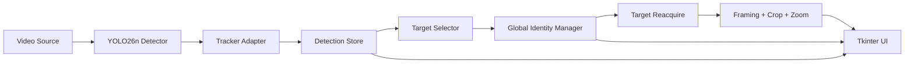

# AutoCamTracker V1 Spec

> Version: V1 demo-first prototype  
> Scenario: racing broadcast / track day reference video  
> Stack: Python + Tkinter + OpenCV + Ultralytics YOLO26n + BoT-SORT ReID / ByteTrack + simple identity management  
> Design principle: V1 must produce a working demo first, while keeping the data model ready for future Vehicle Re-ID.

---

## 1. Product Direction

AutoCamTracker V1 is a lightweight desktop demo for tracking a selected race car in video.

The V1 goal is not to solve full broadcast-grade multi-camera identity tracking. The goal is to quickly build something presentable:

1. Load a racing video or webcam feed.
2. Detect cars with YOLO26n.
3. Show bounding boxes and vehicle thumbnails.
4. Let the user select one car as the target.
5. Keep that selected car centered through digital crop and zoom.
6. Avoid forgetting the selected global identity when the local tracker loses it.
7. Show tracking state clearly: `Tracking`, `SearchingTarget`, `TargetLost`, or `CameraCut`.

The most important rule:

```text
local_track_id can disappear.
selected_global_vehicle_id must not disappear unless the user resets it.
```

---

## 2. Reference Scenario

The main reference is a racing / track day broadcast video. This scenario has several properties that directly affect the design:

- Cars move fast.
- Many cars can be visually similar.
- Cars can overlap or occlude each other.
- Broadcast camera angles can change suddenly.
- The same car may leave one camera view and appear again in a different camera view.

Therefore, V1 must not treat YOLO tracker IDs as permanent identity. YOLO tracking IDs are useful inside one continuous shot, but they are not reliable across hard camera cuts.

V1 should behave like this:

```text
Same continuous shot:
    YOLO26n + tracker follows the selected car.

Short occlusion or missed detection:
    keep selected_global_vehicle_id.
    enter SearchingTarget.
    attempt reacquire.

Hard camera cut:
    reset local tracking state.
    keep selected_global_vehicle_id.
    search candidates in the new shot.
```

---

## 3. V1 Scope

### In Scope

- Python desktop app.
- Tkinter GUI.
- Local video file input as the first demo target.
- Webcam input as secondary input.
- Screen region input for real-time YOLO testing.
- YOLO26n vehicle detection.
- Ultralytics tracking through BoT-SORT ReID first, plain BoT-SORT / ByteTrack as fallback.
- Bounding boxes and vehicle thumbnails.
- Recognized vehicle list that merges short local-track fragments by appearance for inspection.
- Single target selection.
- Identity-ready target state using `global_vehicle_id`.
- Same-shot target tracking.
- Short lost handling.
- Same-shot reacquire.
- Basic camera-cut detection.
- Digital crop and zoom output.
- Before / after display.
- FPS, status, crop, zoom, and debug log.
- Optional recording and CSV evaluation log after the core demo works.

### Out of Scope for V1

- Full Vehicle Re-ID training.
- Guaranteed cross-camera identity matching.
- License plate OCR.
- Race number OCR.
- Web UI.
- Cloud sync.
- Database.
- Auto director for multiple targets.
- Full race-aware camera switching.
- Custom deep tracker training.

---

## 4. Technical Decisions

### 4.1 YOLO26n Usage

Use Ultralytics YOLO26 nano detection model:

```python
from ultralytics import YOLO

model = YOLO("yolo26n.pt")
```

The model should be wrapped inside `detection/yolo26_detector.py` so the rest of the app does not depend directly on Ultralytics result objects.

Recommended first-pass settings:

```text
model: yolo26n.pt
imgsz: 960 or 1280
conf: 0.10 to 0.25
classes: vehicle-related COCO classes
```

Vehicle classes should be configurable. For COCO-style models, start with:

```text
car, motorcycle, bus, truck
```

For the racing demo, `car` is the primary class.

### 4.2 Tracking Choice

V1 should not rely only on bbox center distance for the demo. It may keep a simple tracker as a fallback, but the primary same-shot tracker should use Ultralytics tracking:

```python
results = model.track(
    frame,
    persist=True,
    tracker="custom_botsort.yaml",
    conf=0.15,
    imgsz=960,
)
```

Tracker preference:

1. ReID-enabled BoT-SORT for the current demo because angle changes and short track fragmentation are already visible.
2. Plain BoT-SORT as the baseline A/B comparison.
3. ByteTrack as a simpler fallback.

Recommended tracker tuning direction:

```text
track_buffer: increase to tolerate short missing periods
track_high_thresh: keep moderate
track_low_thresh: allow low-confidence continuation
match_thresh: tune for racing footage
gmc_method: sparseOptFlow or orb for camera motion compensation
with_reid: true for default demo, plain botsort available as A/B baseline
```

### 4.3 Identity Rule

V1 must separate tracker identity from product identity:

| ID | Meaning | Lifetime | Can reset on camera cut? |
|---|---|---:|---:|
| `detection_id` | One detection in one frame | one frame | yes |
| `local_track_id` | Tracker ID inside a continuous shot | short term | yes |
| `global_vehicle_id` | User-selected target identity | session | no |

The selected target is anchored by `selected_global_vehicle_id`, not by `selected_detection_id` or `selected_local_track_id`.

---

## 5. Architecture



| Block | Python Module | Responsibility |
|---|---|---|
| Input | `video/` | Read local video, webcam, or screen region. |
| Detection | `detection/` | Load YOLO26n, run inference, normalize detections. |
| Tracking | `tracking/` | Adapt BoT-SORT / ByteTrack results into local track state. |
| Identity | `identity/` | Keep selected global vehicle identity stable. |
| Data | `data/` | Store current detections, history, thumbnails, candidate scores, and recognized vehicle registry. |
| Framing | `framing/` | Compute crop, zoom, centering error, and smoothed output. |
| UI | `ui/` | Tkinter views, controls, status, thumbnails, and debug panel. |
| Recording | `recording/` | Optional video output and CSV logs. |

---

## 6. Proposed Project Structure

```text
autocam_tracker/
  main.py
  app/
    app_controller.py
    app_state.py
    pipeline_worker.py
  video/
    video_source.py
    webcam_source.py
    video_file_source.py
    screen_region_source.py
  detection/
    yolo26_detector.py
    detection_models.py
    thumbnail_cropper.py
  data/
    detection_store.py
    detection_history.py
    candidate_ranker.py
  tracking/
    tracker_adapter.py
    simple_tracker.py
    target_selector.py
    target_state.py
    custom_botsort.yaml
    custom_bytetrack.yaml
  identity/
    vehicle_identity.py
    simple_identity_resolver.py
    global_identity_manager.py
    reacquire_engine.py
  framing/
    framing_controller.py
    crop_controller.py
    zoom_controller.py
  ui/
    main_window.py
    live_view_panel.py
    vehicle_list_panel.py
    control_panel.py
    status_panel.py
  recording/
    video_recorder.py
    evaluation_logger.py
  config/
    default_config.json
  utils/
    image_utils.py
    geometry.py
    time_utils.py
    scene_cut.py
  tests/
```

---

## 7. Core Data Models

### 7.1 VehicleDetection

```python
from dataclasses import dataclass
from typing import Optional
import numpy as np


@dataclass
class VehicleDetection:
    detection_id: int = -1
    local_track_id: int = -1
    global_vehicle_id: int = -1

    camera_id: int = 0
    shot_id: int = 0
    frame_index: int = 0
    timestamp_ms: float = 0.0

    label: str = "car"
    confidence: float = 0.0

    bbox: tuple[int, int, int, int] = (0, 0, 0, 0)
    center: tuple[int, int] = (0, 0)
    thumbnail: Optional[np.ndarray] = None

    selected: bool = False
    active: bool = True
    lost: bool = False

    color_signature: Optional[np.ndarray] = None
    appearance_score: float = 0.0

    reid_score: float = 0.0
    reid_matched: bool = False
```

### 7.2 VehicleIdentity

```python
from dataclasses import dataclass, field
from typing import Optional
import numpy as np


@dataclass
class VehicleIdentity:
    global_vehicle_id: int
    created_at_ms: float
    last_seen_ms: float = 0.0

    label: str = "car"
    camera_id: int = 0
    shot_id: int = 0

    last_local_track_id: int = -1
    last_bbox: tuple[int, int, int, int] = (0, 0, 0, 0)
    last_center: tuple[int, int] = (0, 0)

    thumbnails: list[np.ndarray] = field(default_factory=list)
    color_signature: Optional[np.ndarray] = None

    lost_frames: int = 0
    status: str = "Tracking"

    reid_score: float = 0.0
    reid_matched: bool = False
```

### 7.3 FrameData

```python
from dataclasses import dataclass, field
from typing import Optional
import numpy as np


@dataclass
class FrameData:
    camera_id: int = 0
    shot_id: int = 0
    frame_index: int = 0
    timestamp_ms: float = 0.0

    raw_frame: Optional[np.ndarray] = None
    detection_frame: Optional[np.ndarray] = None
    cropped_frame: Optional[np.ndarray] = None

    detections: list[VehicleDetection] = field(default_factory=list)

    selected_global_vehicle_id: int = -1
    selected_local_track_id: int = -1
    selected_detection_id: int = -1

    tracking_status: str = "Idle"
    camera_cut_detected: bool = False

    fps: float = 0.0
    inference_time_ms: float = 0.0
    tracking_time_ms: float = 0.0
    reframe_time_ms: float = 0.0

    error_x: float = 0.0
    error_y: float = 0.0
    normalized_error_x: float = 0.0
    normalized_error_y: float = 0.0

    crop_x: int = 0
    crop_y: int = 0
    crop_w: int = 0
    crop_h: int = 0
    zoom_ratio: float = 1.0
    zoom_error: float = 0.0

    lost_frames: int = 0
    candidate_count: int = 0
    reacquire_score: float = 0.0
```

---

## 8. Processing Pipeline

```text
Input frame
  -> detect camera cut
  -> YOLO26n detection / tracking
  -> normalize detections into VehicleDetection
  -> update DetectionStore and thumbnails
  -> if user selected target:
       update GlobalIdentityManager
       match local_track_id if available
       otherwise attempt reacquire
  -> compute framing error
  -> crop and zoom output
  -> push latest FrameData to Tkinter queue
  -> optional recording / evaluation log
```

V1 should use a one-frame queue:

```python
frame_queue = queue.Queue(maxsize=1)
```

The app should prefer dropping old frames over accumulating delay.

---

## 9. Target Selection and Identity Flow

When the user clicks a vehicle thumbnail:

1. Get the detection and current tracker output.
2. Create a new `global_vehicle_id`.
3. Store the current `local_track_id` if available.
4. Save initial thumbnail and color signature.
5. Set `selected_global_vehicle_id`.
6. Start framing from that vehicle bbox.

After selection:

```text
If same local_track_id is visible:
    status = Tracking
    update target bbox and identity profile

If local_track_id is missing but similar candidate exists:
    status = Tracking
    bind candidate local_track_id to selected_global_vehicle_id

If no reliable candidate exists:
    status = SearchingTarget
    keep selected_global_vehicle_id

If missing too long:
    status = TargetLost
    keep selected_global_vehicle_id until user resets
```

---

## 10. Reacquire Strategy

V1 reacquire should be conservative. Do not switch the selected target just because another car has a slightly better score in one frame.

Candidate score can start simple:

```text
score =
  0.40 * local_tracker_match
+ 0.25 * color_similarity
+ 0.15 * bbox_size_similarity
+ 0.10 * center_motion_similarity
+ 0.10 * detection_confidence
```

Rules:

- Require a minimum score before reacquire.
- Require the best candidate to beat the second candidate by a margin.
- Prefer the same `local_track_id` when still available.
- Require stability for several frames before rebinding after a cut.
- If uncertain, remain in `SearchingTarget`.

Suggested thresholds:

```text
reacquire_min_score: 0.65
reacquire_margin: 0.12
reacquire_confirm_frames: 3
lost_to_searching_frames: 5
target_lost_timeout_frames: 120
```

---

## 11. Camera-Cut Handling

V1 should include a simple hard-cut detector. Start with lightweight image statistics:

- color histogram difference
- mean brightness difference
- edge distribution difference

When a camera cut is detected:

```text
shot_id += 1
reset tracker adapter state if needed
clear local_track_id binding
keep selected_global_vehicle_id
set status = CameraCut or SearchingTarget
attempt reacquire in the new shot
```

The user-facing behavior should be calm: the app should show that it is searching for the selected car, not that the selected car has been deleted.

---

## 12. Framing, Zoom, and Crop

Framing uses the selected target bbox when available.

Basic rule:

```text
Target left of center  -> move crop left
Target right of center -> move crop right
Target too small       -> zoom in
Target too large       -> zoom out
```

Implementation requirements:

- Compute `error_x` and `error_y` from target center to frame center.
- Apply a dead zone to avoid jitter.
- Smooth crop movement over time.
- Limit crop rectangle inside source frame.
- Keep previous crop while in short `SearchingTarget`.
- Slowly zoom out when target is uncertain.

This makes the demo feel stable even during brief detection failures.

---

## 13. Tkinter UI

```text
+---------------------------------------------------------------+
| Source / Model / Tracker / Start / Stop / Reset               |
+-------------------------------+-------------------------------+
| Raw / Detection View          | Cropped / Output View          |
| - bbox                        | - centered target              |
| - local/global id             | - digital zoom result          |
| - selected target             | - search/lost overlay          |
+-------------------------------+-------------------------------+
| Vehicle List                  | Control + Status Panel         |
| - thumbnail                   | - FPS                          |
| - confidence                  | - tracking status              |
| - global_vehicle_id           | - error_x / error_y            |
| - selected / lost state       | - crop position / zoom ratio   |
+-------------------------------+-------------------------------+
```

UI rules:

- Tkinter updates must run only on the main thread.
- Video reading, YOLO inference, tracking, and crop run in a worker thread.
- Worker pushes latest `FrameData` into a queue.
- Tkinter uses `root.after()` to poll and update views.
- Vehicle selection events go from UI to controller, then to worker-safe state.

---

## 14. State Machine

Recommended states:

| State | Meaning |
|---|---|
| `Idle` | App is not processing video. |
| `VideoLoaded` | Video file or webcam is opened. |
| `Detecting` | YOLO26n is detecting vehicles. |
| `TargetSelected` | User has selected a vehicle. |
| `Tracking` | Selected vehicle is visible and tracked. |
| `SearchingTarget` | Selected vehicle is temporarily missing. |
| `CameraCut` | Hard cut detected; local tracking is being reset. |
| `TargetLost` | Target lost timeout exceeded, but global identity remains. |
| `Error` | Runtime error occurred. |

Minimum transition:

```text
Idle -> VideoLoaded -> Detecting -> TargetSelected -> Tracking
Tracking -> SearchingTarget -> Tracking
Tracking -> CameraCut -> SearchingTarget -> Tracking
SearchingTarget -> TargetLost
Any State -> Error
```

---

## 15. Recording and Evaluation Log

Recording is useful, but it should not block the core demo.

Suggested output:

```text
recordings/
  raw_output.mp4
  detection_output.mp4
  cropped_output.mp4
  before_after_output.mp4

logs/
  session_log.csv
  debug.log
```

Suggested CSV fields:

```text
timestamp_ms
frame_index
shot_id
camera_id
selected_global_vehicle_id
selected_local_track_id
tracking_status
fps
inference_time_ms
detection_count
candidate_count
target_visible
camera_cut_detected
reacquire_score
error_x
error_y
zoom_ratio
crop_x
crop_y
crop_w
crop_h
lost_frames
```

---

## 16. V1 Development Milestones

### Milestone 1 - Basic Demo Shell

- Create Python project structure.
- Create Tkinter `MainWindow`.
- Load local racing video.
- Display raw frame.
- Add start / stop / reset.

### Milestone 2 - YOLO26n Detection

- Load `yolo26n.pt`.
- Detect vehicles.
- Draw bbox on raw view.
- Show confidence and label.
- Filter vehicle classes.

### Milestone 3 - Tracking Adapter

- Use Ultralytics `model.track`.
- Start with BoT-SORT.
- Add custom tracker YAML.
- Normalize tracker IDs into `local_track_id`.

### Milestone 4 - Vehicle List and Selection

- Crop vehicle thumbnails.
- Display thumbnails.
- Click vehicle item.
- Create `selected_global_vehicle_id`.
- Show selected state in UI.

### Milestone 5 - Stable Target State

- Keep global identity after local tracking loss.
- Add `SearchingTarget`.
- Add same-shot reacquire.
- Add conservative candidate scoring.

### Milestone 6 - Framing, Zoom, and Crop

- Compute `error_x` and `error_y`.
- Apply dead zone and smoothing.
- Add crop output.
- Add zoom control.
- Show before / after views.

### Milestone 7 - Camera-Cut Handling

- Detect hard cuts.
- Increment `shot_id`.
- Clear local track binding.
- Keep selected global identity.
- Attempt reacquire in new shot.

### Milestone 8 - Recording and Debug Log

- Record output video.
- Write CSV evaluation log.
- Display FPS, tracking status, crop position, zoom ratio.

---

## 17. V1 Definition of Done

V1 demo is complete when:

1. App can open a local racing video or selected screen region.
2. Tkinter UI displays raw video.
3. YOLO26n detects vehicles.
4. UI shows bbox and vehicle thumbnails.
5. User can select one vehicle.
6. System creates `selected_global_vehicle_id`.
7. Same-shot tracker follows the selected vehicle.
8. Temporary misses enter `SearchingTarget` instead of immediately losing the target.
9. Camera cuts do not delete the selected global identity.
10. Reacquire attempts are visible and conservative.
11. Framing outputs `error_x` and `error_y`.
12. CropController outputs cropped / zoomed frame.
13. UI displays before / after views.
14. UI displays FPS, tracking status, crop position, and zoom ratio.
15. Data model keeps Re-ID-ready fields: `global_vehicle_id`, `reid_score`, `reid_matched`, `camera_id`.

---

## 18. Future Extension Hooks

| Future Need | V1 Reserved Field / Module |
|---|---|
| Vehicle Re-ID | `reid_score`, `reid_matched`, `identity/` |
| Multi-camera tracking | `camera_id`, `shot_id`, `global_vehicle_id` |
| Better tracker | replace tracker YAML / adapter with ByteTrack, BoT-SORT, TrackTrack, or custom tracker |
| Race number matching | add OCR module later, not V1 |
| Race-aware logic | add camera order, lap timing, estimated arrival time |
| Manual correction | allow user to merge/split global vehicle identities |

V1 principle:

```text
Use YOLO tracking for same-shot continuity.
Use global identity state to avoid forgetting the selected target.
Do not pretend local_track_id is permanent identity.
```
